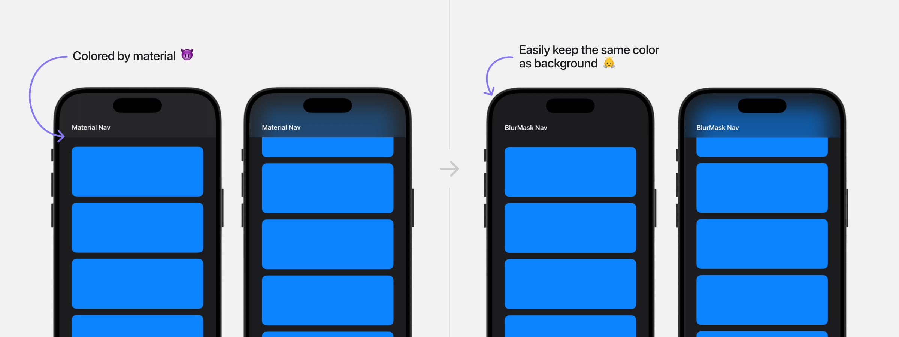

# BlurMask for SwiftUI



Add blur effect mask to your SwiftUI views.

> Highly based on [VariableBlur](https://github.com/nikstar/VariableBlur) by @nikstar

Changes in this version:

- **Removed gradient blur capability** - no more directional blur transitions from VariableBlur
- **Simplified to uniform blur only** - consistent blur intensity across entire masked area
- **Streamlined API** - reduced from complex parameters (direction, startOffset) to simple radius control
- **Eliminated gradient mask generation** - no more CIFilter.linearGradient() calculations for better performance

🟡 Uses private APIs like VariableBlur - potential App Store rejection risk.

## Install

Copy [BlurMask.swift](BlurMask.swift) to your project.

## Usage

```swift
// Basic
BlurMask()                // Default radius: 24
BlurMask(blurRadius: 12)  // custom radius

// View modifier
view.blurMask(radius: 24)

// Navigation bar with blur example
ZStack(alignment: .top) {
  ScrollView {
    // Some content
    }
    .padding(.top, navBarHeight)
  }
  Text("Nav Bar")
    .frame(height: navBarHeight)
    .background(
      BlurMask()
        .ignoresSafeArea(edges: .top)
    )
}
```

Check [ExampleView.swift](ExampleView.swift) for more examples.
